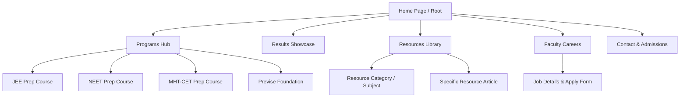
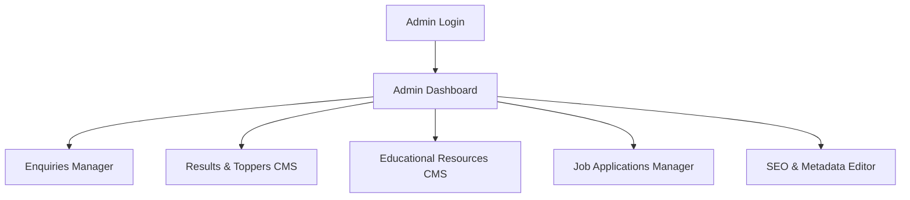
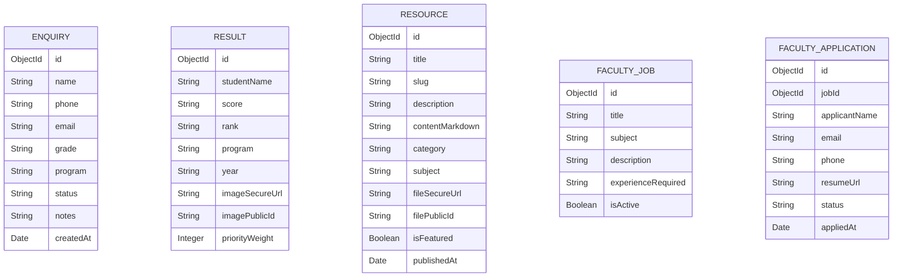
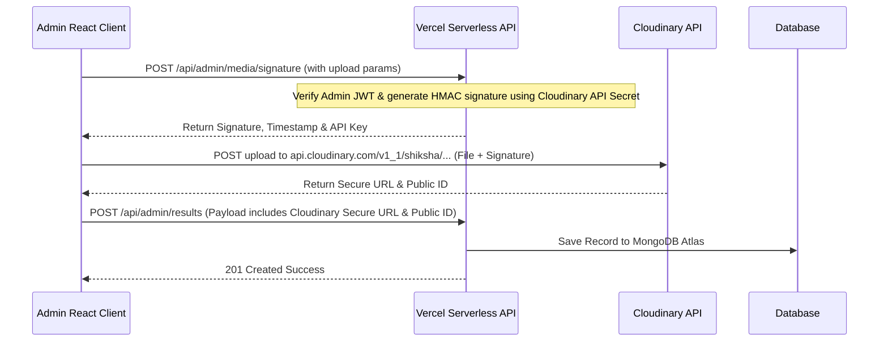

# Architectural Blueprint: Shiksha Classes Premium Institutional Platform

This document presents a comprehensive, high-fidelity system design and implementation blueprint for **Shiksha Classes**, a premium single-branch coaching institute located in Bhandara. The platform is structured to drive student conversions, build parent trust, publish educational resources, and streamline backend admin operations, adhering strictly to the constraints and brand aesthetics.

---

## 1. Information Architecture (IA)

### 1.1 Public Web Portal Structure
The public portal utilizes a highly focused, distraction-free structure without user logins or LMS modules. The page hierarchy and content flows are optimized for trust-building and immediate lead generation.



#### Detailed Page Hierarchy
1.  **Home Page (`/`)**:
    *   **Hero Section**: Compelling value proposition (Bhandara's premier coaching), high-quality imagery, and primary CTA ("Enquire Now").
    *   **Stat Board**: Total selections, top ranks, years of excellence (reinforces parent trust).
    *   **Program Overview Grid**: Fast-entry cards to JEE, NEET, MHT-CET, Previse Foundation.
    *   **Highlights / Philosophy**: What makes Shiksha Classes unique (offline focus, personalized mentoring, curated material).
    *   **Toppers Carousel**: Prominent showcase of latest top rankers with their testimonials.
    *   **Interactive Call-to-Action**: Sticky floating enquiry widget.
2.  **Programs Page (`/programs`) & Subpages (`/programs/[slug]`)**:
    *   Separate landing page for each program (**JEE, NEET, MHT-CET, Previse Foundation**).
    *   Curriculum details, exam pattern, faculty profiles, and dedicated admission enquiry forms.
3.  **Results & Testimonials (`/results`)**:
    *   Comprehensive filterable wall of toppers (Filter by Year, Exam, Percentage/Percentile).
    *   Authentic parent and student testimonials (written & video placeholders).
4.  **Resources Hub (`/resources`) & Subpages (`/resources/[category]/[slug]`)**:
    *   Category filters (e.g., Physics, Chemistry, Mathematics, Biology, Study Tips).
    *   Article view and download portals for PDFs (e.g., question papers, formula sheets).
5.  **Careers Portal (`/careers`)**:
    *   List of active job openings (e.g., "Physics Faculty", "Counselor").
    *   Application form collecting resumes (PDF format).
6.  **Contact & Location (`/contact`)**:
    *   Interactive Google Maps integration (focused on Bhandara branch).
    *   Direct contact details (phone, email, WhatsApp chat trigger).
    *   Main institutional enquiry form.

### 1.2 Admin Portal Structure (`/admin`)
A secure, separate application tailored for administrative personnel.



*   **Enquiry Management**: Real-time view, pipeline updates (New -> Contacted -> Visit Scheduled -> Enrolled/Inactive), and internal counselor notes.
*   **Results CMS**: Create, update, or remove topper cards, adjust priority ranks, and upload photos.
*   **Resources CMS**: Publish study documents, manage tags, upload PDF notes, and compose blog posts.
*   **Careers CMS**: List applicant details, filter by position, and view/download resumes.

---

## 2. Data Architecture (Mongoose / MongoDB Atlas)

We will use MongoDB Atlas. The schemas are structured to optimize queries (e.g. indexing slug, tags, status) and support dynamic data rendering.



### 2.1 Database Schemas

#### Enquiry Schema
```javascript
const EnquirySchema = new mongoose.Schema({
  name: { type: String, required: true, trim: true },
  phone: { type: String, required: true, trim: true },
  email: { type: String, trim: true },
  grade: { type: String, required: true }, // e.g., "10th Passed", "11th", "12th"
  program: { type: String, required: true, enum: ['JEE', 'NEET', 'MHT-CET', 'Previse Foundation'] },
  status: { type: String, default: 'New', enum: ['New', 'Contacted', 'Visit Scheduled', 'Enrolled', 'Closed'] },
  notes: [{
    content: String,
    createdAt: { type: Date, default: Date.now },
    author: String
  }]
}, { timestamps: true });

EnquirySchema.index({ status: 1, createdAt: -1 });
```

#### Result Schema
```javascript
const ResultSchema = new mongoose.Schema({
  studentName: { type: String, required: true, trim: true },
  score: { type: String, required: true }, // e.g., "99.85 Percentile", "680/720"
  rank: { type: String }, // e.g., "AIR 450", "State Rank 12"
  program: { type: String, required: true, enum: ['JEE', 'NEET', 'MHT-CET', 'Previse Foundation'] },
  year: { type: String, required: true }, // e.g., "2025"
  imageSecureUrl: { type: String, required: true }, // Cloudinary CDN URL
  imagePublicId: { type: String, required: true },  // Cloudinary Public ID (for deletion/updates)
  priorityWeight: { type: Number, default: 0 }      // For controlling rendering order
}, { timestamps: true });

ResultSchema.index({ program: 1, year: -1, priorityWeight: -1 });
```

#### Resource Schema
```javascript
const ResourceSchema = new mongoose.Schema({
  title: { type: String, required: true, trim: true },
  slug: { type: String, required: true, unique: true, index: true },
  description: { type: String, required: true },
  contentMarkdown: { type: String }, // Rich text / study tips / blog content
  category: { type: String, required: true }, // e.g., "Formula Sheets", "PYQs", "Blogs"
  subject: { type: String, required: true },  // e.g., "Physics", "Chemistry", "Mathematics", "Biology", "General"
  fileSecureUrl: { type: String }, // Optional attachment URL (Cloudinary PDF)
  filePublicId: { type: String },  // Cloudinary Public ID for PDF file
  isFeatured: { type: Boolean, default: false },
  publishedAt: { type: Date, default: Date.now }
}, { timestamps: true });

ResourceSchema.index({ category: 1, subject: 1, publishedAt: -1 });
```

#### Faculty Job Schema
```javascript
const FacultyJobSchema = new mongoose.Schema({
  title: { type: String, required: true },
  subject: { type: String, required: true }, // e.g. "Physics", "NEET Botany"
  description: { type: String, required: true },
  experienceRequired: { type: String },
  isActive: { type: Boolean, default: true }
}, { timestamps: true });
```

#### Faculty Application Schema
```javascript
const FacultyApplicationSchema = new mongoose.Schema({
  jobId: { type: mongoose.Schema.Types.ObjectId, ref: 'FacultyJob', required: true },
  applicantName: { type: String, required: true },
  email: { type: String, required: true },
  phone: { type: String, required: true },
  resumeUrl: { type: String, required: true }, // Cloudinary Resume URL
  resumePublicId: { type: String, required: true },
  status: { type: String, default: 'Applied', enum: ['Applied', 'Shortlisted', 'Interview Scheduled', 'Rejected'] }
}, { timestamps: true });

FacultyApplicationSchema.index({ jobId: 1, status: 1 });
```

---

## 3. Admin Workflows & Security

### 3.1 Security & Authentication
*   **Authentication Mechanism**: Stateless JWT (JSON Web Tokens) or NextAuth/Auth.js using credentials flow.
*   **Password Hashing**: Bcrypt with a salt factor of 12.
*   **Middleware Guarding**: Route guards validating authorization headers (`Bearer <token>`) on all `/api/admin/*` paths.

### 3.2 Cloudinary Media Management Workflow
To avoid triggering the 4.5MB request limit on Vercel Serverless and bypass server bottlenecks, we use **Signed Frontend Uploads** directly from the Admin React Client to Cloudinary.



### 3.3 Recruitment Review Workflow
1.  **Job Posting**: Admin creates a vacancy in the CMS.
2.  **Application Entry**: Job seekers view openings under `/careers` and submit their application. Resume files are uploaded via signed Cloudinary parameters restricted to PDFs.
3.  **Screening Dashboard**: Admin browses candidates, filters by position, and previews the resume PDF in-app using a lightweight PDF viewer.
4.  **Status Shift**: Admin updates status (e.g., Shortlist), triggering internal status updates in MongoDB.

---

## 4. API Architecture

All endpoints will be hosted on Vercel Serverless.

### 4.1 REST API Routes Matrix

| Method | Endpoint | Description | Auth Required |
|---|---|---|---|
| **POST** | `/api/enquiries` | Submit client admission enquiry form | Public |
| **POST** | `/api/careers/apply` | Submit job application & upload resume | Public |
| **GET** | `/api/programs` | Retrieve all academic programs | Public |
| **GET** | `/api/results` | Retrieve all topper scores & results | Public |
| **GET** | `/api/resources` | Retrieve resources list with pagination/filters | Public |
| **GET** | `/api/resources/[slug]` | Get specific resource details | Public |
| **POST** | `/api/admin/auth/login` | Authenticate admin user, return JWT | Public |
| **POST** | `/api/admin/media/signature` | Generate pre-signed Cloudinary upload payload | Admin (JWT) |
| **GET/POST** | `/api/admin/enquiries` | Retrieve enquiries list (paginated) / Update statuses | Admin (JWT) |
| **POST/PUT/DEL**| `/api/admin/results` | Manage topper results cards | Admin (JWT) |
| **POST/PUT/DEL**| `/api/admin/resources` | Manage educational resource materials | Admin (JWT) |
| **GET/PUT** | `/api/admin/careers/applications`| List applicants & advance application states | Admin (JWT) |

### 4.2 Security Measures
1.  **Rate Limiting**: Apply rate-limiting to public endpoints (e.g., `/api/enquiries` and `/api/careers/apply`) using Vercel KV or `upstash-ratelimit` to prevent spam attacks.
2.  **Data Validation**: Strict runtime schema validation using `zod` on all incoming POST/PUT request bodies.
3.  **Sanitization**: Sanitize Markdown/HTML input in the resources CMS to prevent cross-site scripting (XSS).

---

## 5. Scalability & Performance in Serverless Environments

Vercel Serverless runs in a stateless, ephemeral environment. This demands specific architectural designs:

### 5.1 MongoDB Connection Pooling
In serverless functions, database connections must be cached to prevent exhaustively spawning new connections on every API invocation.
```javascript
// dbConnect.js
import mongoose from 'mongoose';

let cached = global.mongoose;

if (!cached) {
  cached = global.mongoose = { conn: null, promise: null };
}

async function dbConnect() {
  if (cached.conn) {
    return cached.conn;
  }

  if (!cached.promise) {
    const opts = {
      bufferCommands: false,
      maxPoolSize: 10, // Maintain tight connection count limit
    };

    cached.promise = mongoose.connect(process.env.MONGODB_URI, opts).then((mongoose) => {
      return mongoose;
    });
  }
  cached.conn = await cached.promise;
  return cached.conn;
}

export default dbConnect;
```

### 5.2 Dynamic Caching with Vercel Edge / ISR
*   **Incremental Static Regeneration (ISR)**: Since the public pages change only when the admin publishes new content (which is infrequent), we will build the programs, resources, and results pages using ISR (e.g., `revalidate: 3600` or on-demand revalidation hooks triggered by the Admin CMS saves).
*   **Resource Downloads**: Static resources (PDFs) are stored in Cloudinary, which automatically leverages an globally fast CDN.

---

## 6. SEO Structure & Metadata Strategy

To establish maximum visibility in search engines, particularly for terms centered around "Coaching in Bhandara", "NEET Bhandara", and "JEE Classes Bhandara", we define a highly structured metadata and crawling design.

### 6.1 Meta Tag Scheme

Each page will render custom title tags and meta descriptions:
*   **Title Template**: `[Page Title] | Shiksha Classes Bhandara`
*   **Home Page**: `Shiksha Classes | Premier JEE, NEET & MHT-CET Coaching in Bhandara`
*   **Home Description**: `Unlock academic excellence at Shiksha Classes Bhandara. Premier coaching for JEE, NEET, MHT-CET, and Foundation programs. Expert faculty, proven results.`
*   **Open Graph / Twitter Cards**: Custom banners generated dynamically or static high-quality images showcasing brand colors (Slate Panel and Academy Blue) to look premium when shared.

### 6.2 JSON-LD Structured Data
Structured schema markup is embedded as standard JSON-LD on key pages to generate rich results.

#### Home Page Schema (`LocalBusiness` & `EducationalOrganization`)
```json
{
  "@context": "https://schema.org",
  "@type": "EducationalOrganization",
  "name": "Shiksha Classes",
  "address": {
    "@type": "PostalAddress",
    "streetAddress": "Bhandara Main Road",
    "addressLocality": "Bhandara",
    "addressRegion": "Maharashtra",
    "addressCountry": "IN"
  },
  "url": "https://shikshaclasses.in",
  "logo": "https://shikshaclasses.in/logo.png",
  "sameAs": [
    "https://www.facebook.com/shikshaclassesbhandara"
  ],
  "description": "Premium coaching institute for JEE, NEET, and MHT-CET located in Bhandara, Maharashtra."
}
```

#### Program Page Schema (`Course`)
```json
{
  "@context": "https://schema.org",
  "@type": "Course",
  "name": "JEE Prep Course",
  "description": "Comprehensive preparation program for JEE Main & Advanced at Shiksha Classes Bhandara.",
  "provider": {
    "@type": "EducationalOrganization",
    "name": "Shiksha Classes",
    "sameAs": "https://shikshaclasses.in"
  }
}
```

#### Resource Details Page (`BlogPosting` or `Article`)
Dynamically populated with resource information, author, and upload date.

### 6.3 Semantic HTML Structure
To ensure clean parsing by web crawlers, all pages will follow semantic guidelines:
*   Strictly one `<h1>` per page.
*   Structured subheadings (`<h2>`, `<h3>`) representing curriculum blocks, topper categories, etc.
*   Explicit `alt` text for all images, especially student toppers (e.g., `alt="Topper Name - 99.5% in JEE Main 2025"`).

---

## 7. Open Questions & Design Decisions

> [!IMPORTANT]
> The following architectural decisions require confirmation from the stakeholder:
> 
> 1. **Authentication Choice**: Do you prefer simple JWT token cookies, or is a system like **NextAuth/Auth.js** preferred for scalability in case additional admins are added later?
> 2. **Resume Delivery Notifications**: When candidates submit applications, should the admin get an email notification, or is checking the Admin Portal Careers Dashboard sufficient?
> 3. **Lead Notifications**: Should incoming admission enquiries be synced to an email inbox (via Nodemailer/Resend) in addition to being stored in the MongoDB Atlas database?
> 4. **Incremental Static Regeneration (ISR) vs Server-Side Rendering (SSR)**: We plan to use ISR for pages like `/results` and `/resources` for fast load times. Should we set up on-demand cache revalidation (which refreshes the cache immediately when an admin saves details) or is a time-based refresh (e.g., every 30 minutes) acceptable?
